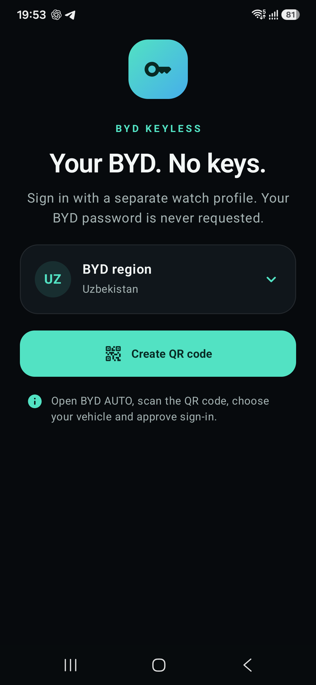
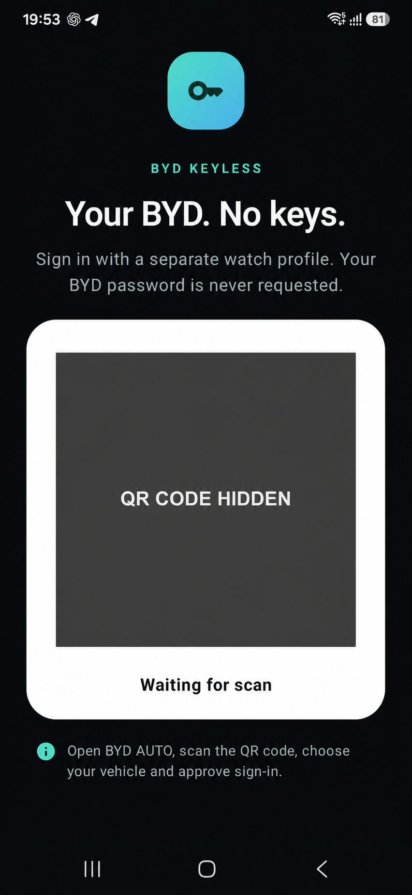
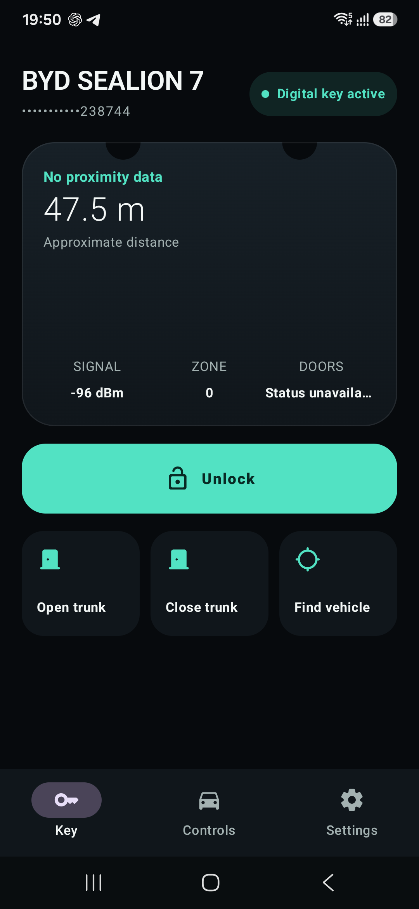
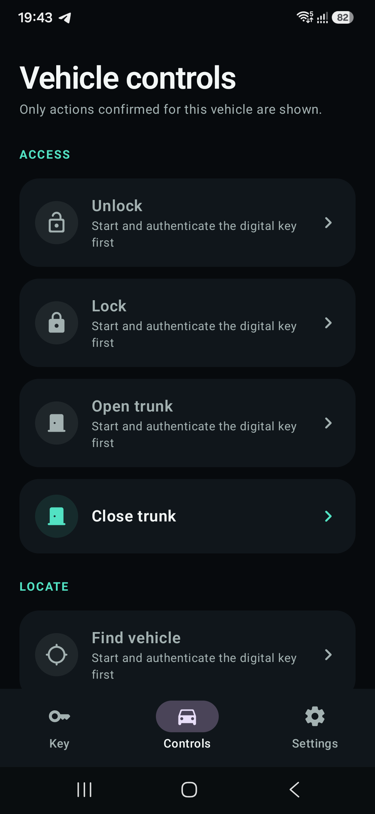
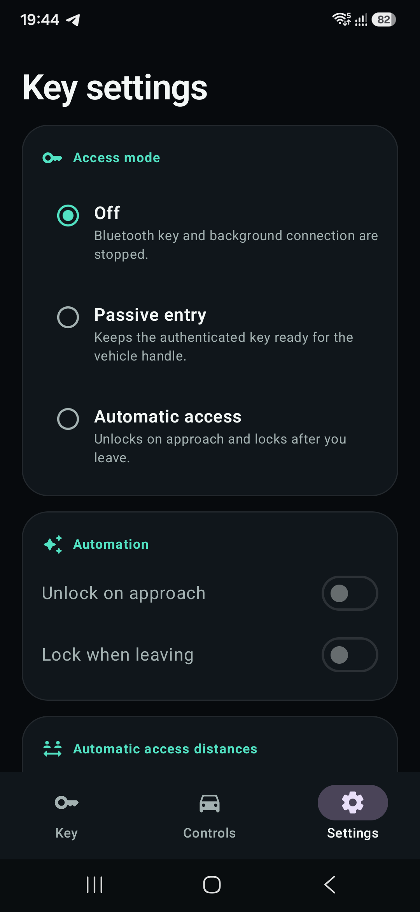
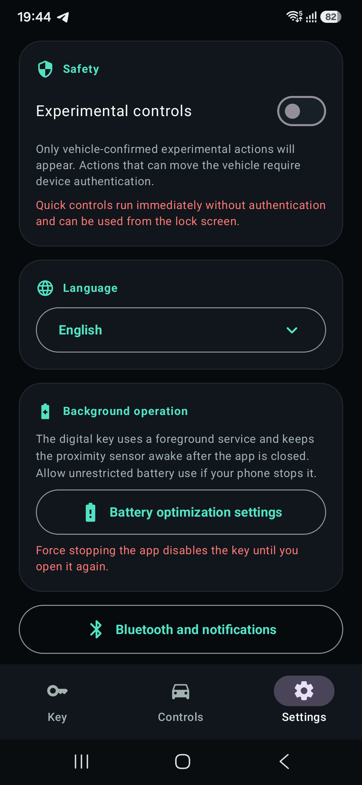

# BYD Keyless

An experimental ARM64 Android app for using a BYD Sealion 7 watch credential as a Bluetooth key. The app signs in through the official BYD AUTO QR flow, obtains a separate watch token and BLE `dkey`, and keeps an authenticated BLE connection in a `connectedDevice` foreground service.

> Independently built and unofficial; not affiliated with or endorsed by BYD. This client uses an unpublished protocol. Test only on a vehicle you own or are explicitly authorized to control, and keep a working physical key available. Redistribution rights for the bundled native libraries have not been independently verified; review [Third-party components](THIRD_PARTY.md) before redistributing them.

## Features and compatibility

- QR authorization, vehicle profile and Bluetooth key retrieval through the BYD Watch API.
- Manual vehicle controls, capability-gated experimental commands, passive entry and calibrated automatic unlock/lock.
- Notification actions, a home-screen widget and launcher shortcuts.
- English, Russian and Uzbek interface translations.

Requires Android 8.0 (API 26) or later and an `arm64-v8a` device. Only ARM64 native libraries are bundled: x86/x86_64 emulators and other ABIs are not supported. The prototype targets the Sealion 7; compatibility with other vehicles, account regions or future BYD backend versions is not guaranteed. Available commands depend on the vehicle's advertised capabilities and key validity.

## Screenshots

Device captures of the English interface, with automatic access disabled. The digital-key screen shows an active key; the other screens were captured with the key stopped or after sign-out. The QR sign-in image was edited to completely hide its authorization code. No vehicle commands were invoked for these captures. Available controls depend on the vehicle and connection state.

| Welcome | QR sign-in (code hidden) | Digital key |
| :---: | :---: | :---: |
| [](docs/screenshots/welcome.png) | [](docs/screenshots/qr-sign-in-redacted.png) | [](docs/screenshots/key.png) |

| Vehicle controls | Access modes | Safety and background operation |
| :---: | :---: | :---: |
| [](docs/screenshots/controls.png) | [](docs/screenshots/access-settings.png) | [](docs/screenshots/safety-settings.png) |

Select a screenshot to view it at full resolution. See the [screenshot capture notes](docs/screenshots/README.md) for capture conditions and privacy edits.

## Download

Install the signed ARM64 APK from [GitHub Releases](https://github.com/VitalyArt/byd-keyless/releases) when a release is available. Version tags publish new builds automatically after CI succeeds; see [Release setup and publishing](docs/RELEASING.md). Until the first release, build from source below.

## Build

Requirements:

- JDK 17, selected through `JAVA_HOME` (or Android Studio's Gradle JDK setting).
- Android SDK Platform 36, Build-Tools 34.0.0 and Platform-Tools. Build-Tools 34.0.0 matches the existing Android Gradle Plugin 8.3.2 default.
- Network access for the initial Gradle and dependency downloads.

Use your own installation directories below; do not commit machine-specific paths:

```bash
export JAVA_HOME="/path/to/jdk-17"
export ANDROID_HOME="/path/to/android-sdk"
export PATH="$JAVA_HOME/bin:$ANDROID_HOME/platform-tools:$PATH"
```

Install SDK packages with Android Studio's SDK Manager, or with the Android command-line tools:

```bash
sdkmanager "platforms;android-36" "build-tools;34.0.0" "platform-tools"
```

Accept the Android SDK licenses when prompted. Android Studio can create an ignored `local.properties` containing `sdk.dir` instead of using `ANDROID_HOME`. Do not put a local `org.gradle.java.home` path in the project's `gradle.properties`.

Build and check with the committed Gradle Wrapper; no global Gradle installation is required:

```bash
./gradlew :app:testDebugUnitTest :app:lintDebug :app:assembleDebug
```

On Windows, set the equivalent environment variables and use `gradlew.bat` with the same tasks.

The debug APK is written to `app/build/outputs/apk/debug/app-debug.apk`. To install it on a connected ARM64 phone with USB debugging enabled:

```bash
adb install -r app/build/outputs/apk/debug/app-debug.apk
```

This uses Android's local debug signing key. No release signing credentials are included or required. The existing Gradle 8.6, AGP 8.3.2 and Kotlin 1.9.22 versions are intentionally unchanged; SDK compatibility and other known warnings are recorded in [Publication checks](docs/PUBLISHING.md).

## First use

1. Install the release APK (or a locally built debug APK) on an ARM64 Android phone.
2. Create a QR code in the app, scan it in BYD AUTO, choose the Sealion 7 and approve the watch sign-in.
3. Grant the requested Bluetooth/location and notification permissions, then start the key while the app is visible.
4. Verify manual unlock and lock while standing next to the parked car.
5. Capture RSSI at approximately 1 m and 5 m before enabling automatic access.

Auto unlock and auto lock remain disabled until calibration and successful manual lock/unlock. Auto lock additionally requires a BLE command response no older than 30 seconds to confirm closures are closed. Calibration collects 8 signal samples. An unconfirmed automatic command pauses automation until a manual lock/unlock succeeds. See [background reliability changes and device checks](docs/BACKGROUND-RELIABILITY.md).

## Permissions

- Nearby devices / Bluetooth: discovery and communication with the vehicle; older Android versions also require location permission for BLE scanning.
- Notifications: foreground-service status and quick controls.
- Internet: QR authorization, credential retrieval and supported cloud commands.
- Foreground service, wake lock and boot handling: background key operation and resume notifications, subject to Android and device-vendor restrictions.

## Quick controls

- The foreground-service notification shows Unlock, Lock and Trunk as three explicit actions. It does not contain an emergency-stop action.
- Add the **BYD Keyless** widget from the Android widget picker for separate Unlock, Lock and Trunk buttons. The same actions are available as launcher shortcuts by long-pressing the app icon.
- Quick actions connect the BLE key on demand and wait up to 20 seconds for authentication before failing.

Notification and widget controls execute without device authentication and may be available from the lock screen. Launcher shortcuts now show a confirmation dialog before sending a command. Only enable notification access on a phone you trust.

## Privacy and credentials

- The saved session contains the Watch tokens, control password, VIN, vehicle profile and BLE key. It is encrypted with AES-GCM using an Android Keystore key.
- Preferences also contain an unencrypted copy of the active VIN for resetting vehicle-specific settings, a generated watch identifier, language/region settings and calibration values. These are app-private preferences, not an encrypted database. Android backup is disabled for the app.
- App-level network logging records endpoint/status/error information rather than request bodies or credential values. This is not a guarantee about logging inside third-party native libraries.
- Signing out clears the locally saved session and disables keyless settings. Never publish tokens, control passwords, BLE keys, session dumps or unredacted device logs. Share VINs or QR codes only with the owner's explicit permission; prefer expired QR codes for documentation.

## Safety boundaries

- A command is rejected in the controller unless the BYD vehicle configuration advertises its `functionCode`.
- Experimental commands with no confirmed capability remain visible but disabled. Commands capable of moving or powering the vehicle also require the system device credential.
- **Emergency stop is in the app's Settings.** It disables the proximity mode and automatic unlock/lock, disconnects Bluetooth and stops the foreground service. Android's Force stop can also be used to terminate the app. Quick controls may reconnect when invoked again.
- Force-stop, OEM battery restrictions and revoked Bluetooth permission can prevent background key operation. Do not rely on the app as your only means of access or as proof that the car is locked.
- BLE RSSI provides a calibrated proximity zone, not a precise physical distance.

Before testing on a real vehicle, run the staged sequence: connect/read only → manual unlock/lock → trunk/find car → passive handle → calibrated auto unlock → observed auto lock. Keep the vehicle parked and treat every additional command as unverified until the car advertises the capability and returns a successful acknowledgement.

## Tests and CI

Unit tests cover protocol formatting/cryptography, mocked Watch API flows, command policies, proximity, quick controls, manifest permissions, launcher shortcuts and translations. They do not require a BYD account or a vehicle.

The [Android CI workflow](.github/workflows/android.yml) runs unit tests, Android lint and a debug build on pushes and pull requests, and retains test/lint reports. Version-tag pushes also build, sign and publish a release APK after the checks succeed; signing requires the one-time [release setup](docs/RELEASING.md). CI does not execute commands against a vehicle. Reports are available locally under `app/build/reports/` and `app/build/test-results/`.

The native instrumentation smoke test requires a connected ARM64 Android device and is separate from CI:

```bash
./gradlew :app:connectedDebugAndroidTest
```

It loads JNI libraries and exercises local frame construction; it does not establish a vehicle connection. Automated checks do not validate real-world vehicle behavior.

## Protocol references and licensing

The Kotlin Watch implementation was developed against separate PHP Watch API work and an offline Python reference. Those external working copies are not distributed here or required to build this project; the included tests are the available regression reference.

No project license has been selected and no `LICENSE` file is provided. Do not assume an open-source license applies to this code or to the bundled binaries. See [Third-party components](THIRD_PARTY.md) for their recorded provenance and unresolved licensing information, and [Publication checks](docs/PUBLISHING.md) before uploading the repository.
