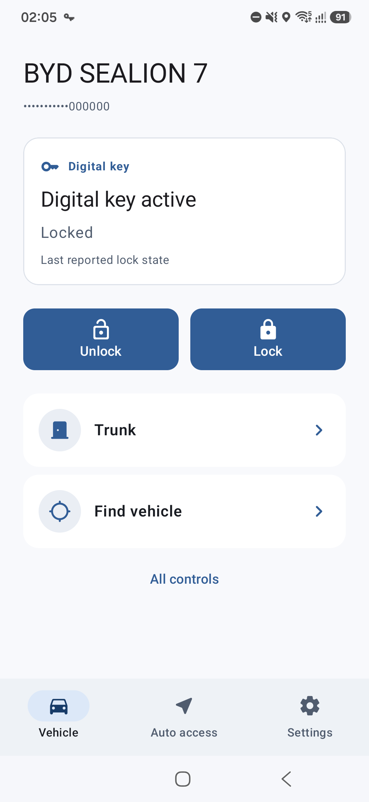
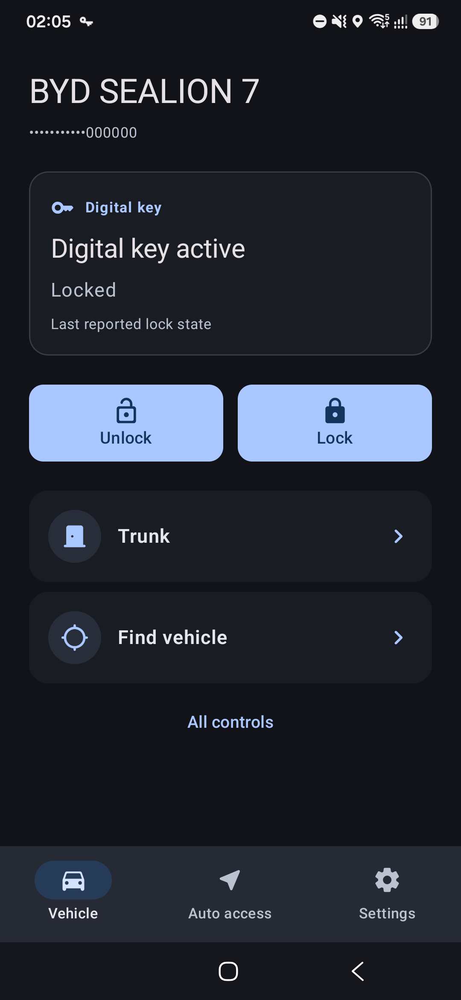
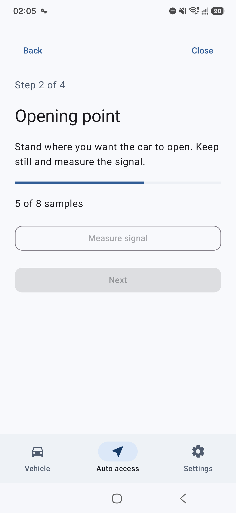
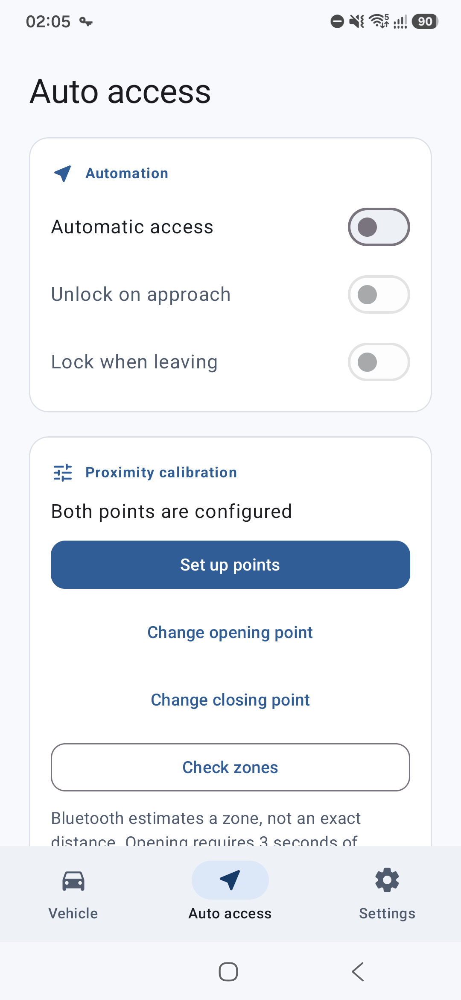
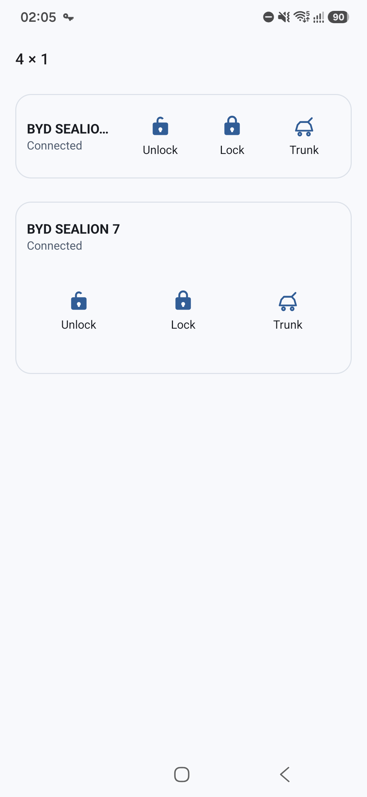
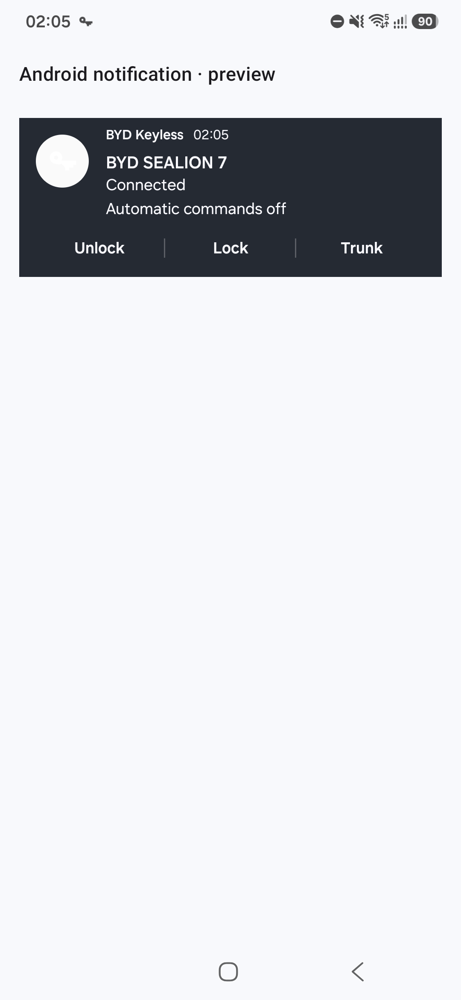

# Interface screenshots

## Redesign previews

The `*-light-*.png` and `*-dark-*.png` files are device captures from the isolated `com.vitalyart.bydkeyless.preview` package, using fictional vehicle state. They show the actual Compose screens, widget RemoteViews and Android notification template. They do **not** demonstrate a vehicle connection or successful physical command.

| Vehicle, light | Vehicle, dark | Point calibration |
| --- | --- | --- |
|  |  |  |

| Auto access | Widgets | Notification template |
| --- | --- | --- |
|  |  |  |

Additional captures cover English settings, dark widgets and a 160% font scale. Every documentation screenshot is in English. Notification previews inflate the real Android template inside the preview activity on a matching system-theme surface; the actual notification drawer controls background, expansion and action visibility. Widget previews inflate both compact and expanded layouts inside the activity; launcher-specific sizing remains a separate check.

## Reproduce without vehicle access

Build with JDK 17 and the configured Android SDK:

```sh
./gradlew :app:assembleDebug :app:assembleDebugAndroidTest -PuiPreview=true
adb install -r app/build/outputs/apk/debug/app-debug.apk
adb install -r app/build/outputs/apk/androidTest/debug/app-debug-androidTest.apk
adb shell am start -S -W -n com.vitalyart.bydkeyless.preview/com.vitalyart.bydkeyless.DesignPreviewActivity --es screen home --es theme light --es language en
adb exec-out screencap -p > home-light-en.png
```

Available screens: `home`, `access`, `prepare`, `measure`, `review`, `error`, `settings`, `welcome`, `widgets`, `notification`. Themes: `light` and `dark`; the documentation capture language is `en`; optional `--ef fontScale 1.6`.

The preview activity exists only in debug builds and refuses to run unless the application ID ends in `.preview`. The main app installation, credentials and vehicle settings are not modified. Home command callbacks are inert, widget preview click listeners are removed, and notification preview buttons only reopen the preview activity. The harness can show above the lock screen and keeps the display awake while open.

Run isolated device checks:

```sh
adb shell am instrument -w -e class com.vitalyart.bydkeyless.storage.SettingsMigrationTest,com.vitalyart.bydkeyless.quick.QuickSurfaceTest com.vitalyart.bydkeyless.preview.test/androidx.test.runner.AndroidJUnitRunner
```

The settings tests refuse to run against the main app package. They cover removal of Passive Entry, legacy threshold migration, persisted automation pause, failed-save rollback and session reset. Surface tests cover notification action order/busy state and widget layout inflation/disabled actions.

## Validation performed

Validated on a Samsung SM-S936B running Android 16 (API 36): five instrumented tests passed. The final standard debug build passed 67 JVM tests and Android lint (zero errors; warnings remain). Preview and test packages were removed after capture; the main installed app was not updated or modified.

Design references: [Android navigation](https://developer.android.com/design/ui/mobile/guides/layout-and-content/layout-and-nav-patterns), [accessibility](https://developer.android.com/design/ui/mobile/guides/foundations/accessibility), [widget guidance](https://developer.android.com/design/ui/mobile/guides/widgets), [system notification templates](https://developer.android.com/develop/ui/views/notifications/custom-notification), and [progressive disclosure](https://www.nngroup.com/articles/progressive-disclosure/).

## Remaining device acceptance

Check actual launcher placement and resizing with multiple widget instances, TalkBack navigation, Android 8/12 layouts, process recreation and real Bluetooth calibration beside a parked vehicle. Preview captures and automated tests do not establish radio accuracy or physical command reliability.
